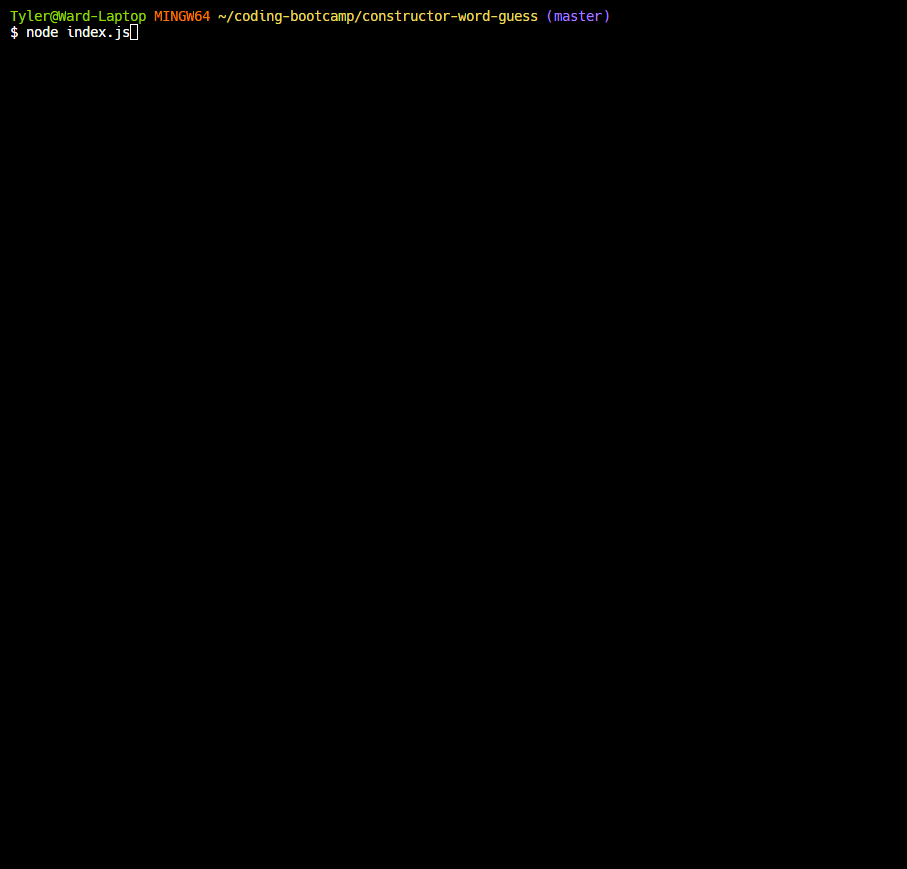

# constructor-word-guess
*Node.js word guess CLI game*

## Purpose:
The CLI word guess game built using javascript for Node.js allowed me to practice using node package manager as well as the require/module.exports functionality for constructors present in other javascript file. Prior to this most of the work I have done has used only a single javascript file. 

## How it works:
The game works by using 3 seperate javascript files. The first file is letter.js which contains a constructor for a letter object that holds a single character as well as a boolean value for whether the letter has been guessed or not. The letter prototype contains a function for displaying the letter when toString is called or the letter would be concatenated to a string by a join or other function. If the letter hasn't been guessed it will be represented by an underscore character. The other prototype function is used for guessing the letter and changes the boolean value if the correct letter was guessed. This constructor is then exported and used by the next file, Word.js. 

The Word.js file requires the letter file and contains an object constructor for a word object that is an array made up of letter objects. I wrote 2 prototype methods for it one of which joins the array back into a string and the other for guessing letters. This object constructor is then exported for use in the final file, index.js. 

The index.js file requires the word.js file and is where the actual game functionality takes place. This file also requires 2 npm packages, chalk and inquirer, for colorizing CLI text and prompting the user for input, respectively. A guess count is set to 10 and an array of word objects is built. A random function is included for randomizing which word is chosen and ensures no repeats by moving used words to a different array. The main game takes place in a recursive function called wordGuessPrompt. This checks to see if the are any unguessed letters left in the current word and that there are still guesses left. The user is then prompted to guess a letter via inquirer and their input is validated to only be a single character and only an alphabet character. If the letter matches a letter in the word, they get a correct response and the letter is inserted into the word and replaces the placeholder underscore. If the letter is not present in the word the user gets an incorrect response and loses a guess.
Once a word has been guessed or the guess count reaches 0 another random word is chosen and the game starts over by calling the game function recursively. Once all words from the word list have been used the game ends.

## How to use:
A random word or words from a predetermined list are displayed with underscores for each letter and the user is prompted for a letter guess. A user must input a single letter (upper or lowercase) to guess a letter present in the word. If the letter is present they do not lose a guess count and the letter is displayed in place of the underscores. If the guess was incorrect the user loses a guess. This continues until all the letters in the word have been guessed or the user is out of guesses. The game continues until the list of words have all been used.

## Contributors:
This project is maintained and contributed to solely by myself, Tyler Ward.